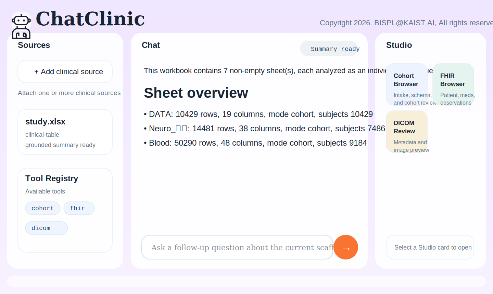

# ChatClinic

Skill- and tool-driven clinical data and medical imaging analysis workspace.



## What it is

`ChatClinic` is a multimodal review workspace for:

- clinical CSV/TSV and Excel eCRF tables
- FHIR JSON/XML/NDJSON
- HL7 v2 message files
- plain-text clinical notes
- DICOM medical imaging files

The application uses a `Sources / Chat / Studio` layout and is designed around:

- a shared orchestration Skill
- a tool registry
- a shared runner
- Studio artifacts rendered from tool outputs

## Read first

- [Course tool contract](docs/COURSE_TOOLS.md)
- [Tool plugin guide](docs/TOOL_PLUGIN_GUIDE.md)

If you are a collaborator or student team adding a new tool, start with those two files first.

## Quick start

```bash
cd /Users/jongcye/Documents/Codex/workspace/clinical_multimodal_workspace
cp .env.example .env
```

Then set:

```bash
OPENAI_API_KEY=sk-...
OPENAI_WORKFLOW_MODEL=gpt-5-nano
OPENAI_MODEL=gpt-5-mini
```

## Core architecture

- `ChatClinic` provides the shared UI and review experience
- `skills/chatclinic-orchestrator/` contains the orchestration policy
- `plugins/` contains executable tools
- `app/services/tool_runner.py` runs registered tools through a shared runner
- `Studio` renders structured outputs returned by tools

## Classroom plugin workflow

Recommended teaching model:

- the instructor runs one shared `ChatClinic`
- each student team submits one plugin folder
- students do not need to submit a separate Skill by default
- the orchestration Skill is maintained centrally
- if a new tool changes routing or policy, the Skill should also be reviewed

Expected plugin layout:

```text
plugins/
  team_name_tool/
    tool.json
    run.py
```

Current examples:

- `plugins/cohort_sheet_browser/`
- `plugins/dicom_review_tool/`
- `plugins/fhir_browser_tool/`

## Student deliverable model

Student teams usually submit:

- `tool.json`
- `run.py`
- optional helper scripts, model weights, and `requirements.txt`

Student teams usually do not submit:

- a separate orchestration Skill
- a separate always-on tool server
- a separate frontend

## Included example data

The repository includes sample files for local testing under `examples/`, including:

- cohort Excel files
- FHIR JSON/XML and bulk NDJSON
- HL7 message samples
- chest X-ray and DICOM examples

## Key project files

- `app/main.py`
- `app/services/tool_runner.py`
- `app/services/skill_orchestrator.py`
- `skills/chatclinic-orchestrator/SKILL.md`
- `docs/COURSE_TOOLS.md`
- `docs/TOOL_PLUGIN_GUIDE.md`
